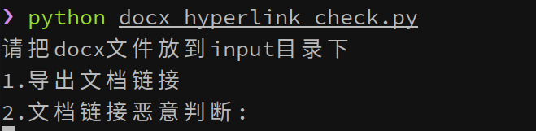

# docx_hyperlink_check
收集docx文件中的超链接并可以使用[norton网页检查](https://safeweb.norton.com/)进行超链接批量判断。
***
```shell
python docx_hyperlink_check.py

# dir tree
#.
#├── docx_hyperlink_check.py
#├── input
#│   └── test.docx
#├── README.md
#└── requirements.txt
```
docx文件存放到input中
***

